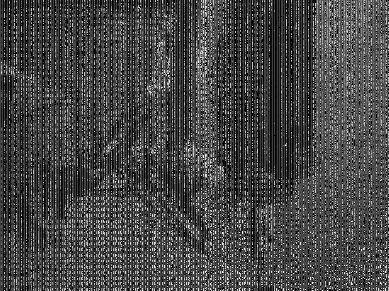
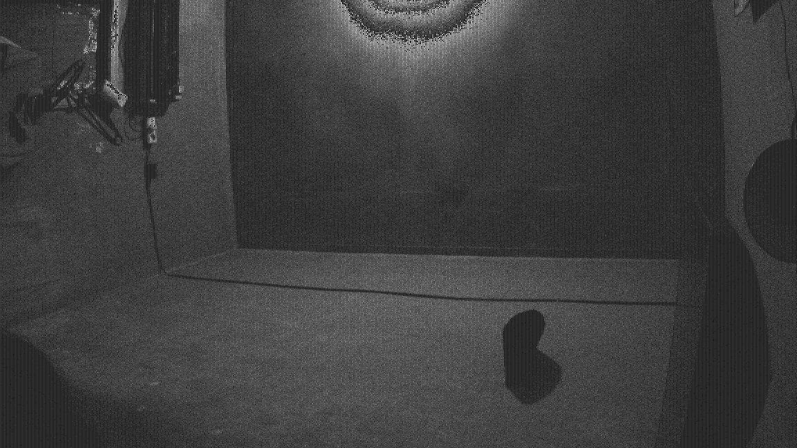
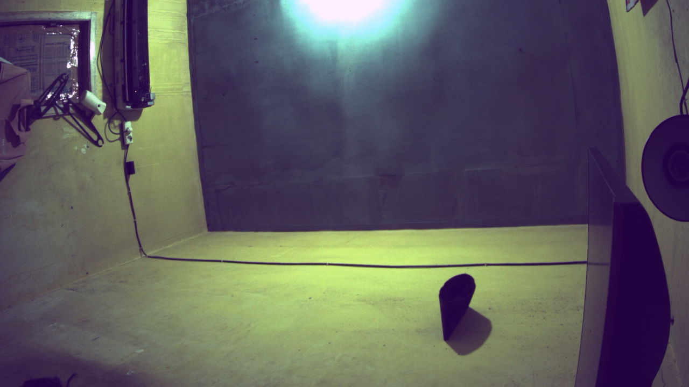

# Luckfox Pico Mini B — Kamera CSI (SC3336) di Ubuntu

Menjalankan kamera MIPI CSI-2 pada image **Ubuntu** Luckfox — bukan Buildroot.

Banyak sumber (termasuk catatan saya sendiri sebelumnya) menyimpulkan kamera tidak bisa jalan
di Ubuntu karena RAM 56 MB terlalu sempit. **Kesimpulan itu salah.** Masalahnya bukan total RAM,
melainkan **fragmentasi memori** dan **urutan pemuatan modul**.



*Frame nyata dari sensor: kusen pintu dan kursi. Garis vertikal halus adalah pola Bayer yang
belum di-demosaic — normal untuk data mentah langsung dari CIF tanpa pemrosesan ISP.*

---

## Ringkasan hasil

| Hal | Status |
|---|---|
| Sensor SC3336 terdeteksi | ✅ `Detected OV00cc41 sensor` di I2C bus 4, alamat 0x30 |
| ISP probe | ✅ berhasil setelah kompaksi memori |
| Tautan sensor → CIF | ✅ `Async subdev notifier completed` |
| Format ternegosiasi | ✅ `SBGGR10_1X10/2304x1296` |
| Tangkap frame 320×240 | ✅ 122.880 byte (CMA bawaan) |
| Tangkap frame 640×480 | ✅ 491.520 byte (CMA bawaan) |
| Tangkap frame 1280×720 | ✅ dengan `rk_dma_heap_cma=16M` |
| Tangkap frame 2304×1296 | ✅ 3.981.312 byte dengan `rk_dma_heap_cma=16M` |
| **Gambar siap pakai via ISP** | ✅ NV12 dari `rkisp_mainpath`, tajam & tanpa noise kroma |
| ISP resolusi penuh 2304×1296 | ✅ 4.478.976 byte dengan `rk_dma_heap_cma=16M` |
| Rekonstruksi warna dari raw di penerima | ❌ belum terpecahkan (lihat Masalah 4) |

Diuji pada Ubuntu 22.04.3 LTS armhf, kernel 5.10.160, board Luckfox Pico Mini B.

---

## Masalah 1 — ISP gagal probe: fragmentasi, bukan kekurangan RAM

Gejalanya:

```
rkisp_hw ffa00000.rkisp: No reserved memory region. default cma area!
[<b0228c3b>] (devm_kmalloc) from [<af863e0d>] (rkisp_plat_probe+0x39/0x514 [video_rkisp])
rkisp: probe of rkisp-vir0 failed with error -12
```

`-12` = ENOMEM. Yang gagal adalah **`devm_kmalloc`** — alokasi memori kernel biasa yang
membutuhkan **halaman fisik kontigu**. Alokasi orde tinggi bisa gagal meski `MemFree` besar,
kalau memori sudah terfragmentasi.

Buktinya ada di `/proc/buddyinfo` — jumlah blok bebas per orde (kiri orde-0 = 4 KB,
makin ke kanan makin besar):

```
sebelum kompaksi : 738  663  134   25   19    9    5    4    0
sesudah kompaksi :  11   64   65   36   22   11    7    6    8
                                                        ↑ orde-8
```

Sebelum kompaksi, **orde tertinggi berjumlah nol** padahal `MemFree` 17 MB: banyak halaman kecil,
tidak ada blok besar. Setelah `drop_caches` + `compact_memory`, orde-8 terisi dan probe berhasil.

> **Kenapa memori sudah terfragmentasi padahal uptime baru ~20 detik?**
> Modul kamera dimuat dari `rc.local`, yang berjalan **di akhir** rantai boot setelah systemd
> menyalakan hampir semua layanan. Angka uptime kecil menyesatkan — puluhan proses sudah lahir
> dan mati sebelum itu.

> **Jangan tertipu baris `No reserved memory region. default cma area!`.** Itu hanya informasi
> bahwa ISP akan memakai CMA default, bukan penyebab kegagalan. Menaikkan `rk_dma_heap_cma`
> untuk memperbaiki probe **tidak berhasil** dan justru memangkas `MemTotal` dari 57 MB ke 42 MB —
> memperburuk, karena `devm_kmalloc` butuh RAM normal, bukan CMA.

## Masalah 2 — Urutan pemuatan modul

Memuat `video_rkcif` sebelum driver sensor membuat async notifier gagal menautkannya:

```
rkcif-mipi-lvds: get_remote_sensor: remote pad is null
rkcif_update_sensor_info: stream[0] get remote sensor_sd failed!
```

Urutan yang benar (mengikuti `insmod_ko.sh` bawaan Luckfox):

```
rk_dvbm → sc3336 → video_rkcif → video_rkisp
        → phy-rockchip-csi2-dphy-hw → phy-rockchip-csi2-dphy
        → clr_unready_dev untuk rkcif dan rkisp
```

Penanda berhasil:

```
rockchip-csi2-dphy csi2-dphy0: dphy0 matches m00_b_sc3336 4-0030
rkcif-mipi-lvds: Async subdev notifier completed
rkisp rkisp-vir0: clear unready subdev num: 0
```

> `rockit`, `mpp_vcodec`, `rga3`, dan `rknpu` **tidak perlu** dimuat untuk capture V4L2 mentah.
> `rockit` justru merugikan: ia menelurkan sepuluh thread yang tersangkut permanen di state D
> (`vlog valloc vsys vrga_0 vrga_1 venc rkisp-vir0 vpss vrgn vmcu`), membuat load average board
> idle melonjak ke ~10 padahal CPU 99% idle. Thread itu juga tidak bisa dilepas — `rmmod`
> menggantung selamanya.

## Masalah 3 — CMA membatasi resolusi

Setelah pipeline jalan, alokasi buffer capture gagal di resolusi besar:

```
vb2_cma_sg_alloc_contiguous: cma_en:1 alloc pages fail
VIDIOC_REQBUFS returned -1 (Cannot allocate memory)
```

Buffer capture diambil dari **CMA**, yang bawaannya hanya 1 MB (`rk_dma_heap_cma=1M`).
Kebutuhan per frame RAW10:

| Resolusi | Size Image | 2 buffer | Muat di CMA 1 MB? |
|---|---:|---:|---|
| 320×240 | 122.880 | 245.760 | ✅ |
| 640×480 | 491.520 | 983.040 | ✅ (pas) |
| 1280×720 | 1.290.240 | 2.580.480 | ❌ |
| 2304×1296 | 3.981.312 | 7.962.624 | ❌ |

**Di sinilah menaikkan CMA benar-benar tepat** — berbeda dari kasus probe ISP tadi.

Caranya ada di repo Wiki, Bagian 12 (`scripts/uboot/patch_bootargs.py`) — `fw_setenv` tidak
tersedia dan Ctrl+C tidak menginterupsi U-Boot, jadi partisi env ditulis langsung dengan
CRC32 dihitung ulang:

```bash
sudo dd if=/dev/mmcblk1p1 of=/tmp/env.bin bs=1k count=32
sudo python3 patch_bootargs.py /tmp/env.bin /tmp/env16.bin \
     "rk_dma_heap_cma=1M" "rk_dma_heap_cma=16M"
sudo dd if=/tmp/env16.bin of=/dev/mmcblk1p1 bs=1k count=32 conv=fsync
sync && sudo reboot
```

### Hasil dengan CMA 16 MB



*Resolusi penuh SC3336. Pratinjau diperkecil 2×; garis Bayer jadi kurang tampak karena
penyampelan, dan struktur pemandangan terlihat jelas.*

```
Size Image : 3.981.312 byte
statistik  : min/max 0/255, rata-rata 62,6, 256 nilai unik
```

256 nilai unik berarti seluruh rentang dinamis 8-bit terpakai.

### Biaya memori yang terukur

| | CMA 1 MB | CMA 16 MB |
|---|---:|---:|
| `MemTotal` | 57.372 kB | 42.012 kB |
| `MemAvailable` (idle) | ~30.000 kB | ~21.000 kB |
| Resolusi maksimum | 640×480 | 2304×1296 |

**Kamera dan layanan lain bisa berdampingan.** Diuji dengan mosquitto + publisher telemetri
berjalan bersamaan pada CMA 16 MB: `MemAvailable` tetap ~21 MB dan semuanya stabil. Jadi
menaikkan CMA tidak berarti mengorbankan proyek lain di board yang sama — hanya menyempitkan
ruang gerak.

---

## Masalah 4 — Warna: kendali eksposur berhasil, rekonstruksi warna belum

Frame mentah dari CIF adalah Bayer tanpa demosaic. Upaya merekonstruksi warna di sisi
penerima **belum berhasil**, dan ini catatan jujur tentang sejauh mana penelusurannya sampai.

### Eksposur dan gain harus diatur manual

Tanpa `rkaiq`, tidak ada auto-exposure. Sensor memakai default yang sangat gelap:

```
exposure      : min=1   max=1352   value=128    <- hampir minimum
analogue_gain : min=128 max=99614  value=128    <- minimum
```

Subdev sensor adalah yang punya kontrol ini — cari dengan:

```bash
for d in /dev/v4l-subdev*; do
  v4l2-ctl -d $d --list-ctrls 2>/dev/null | grep -qi exposure && echo "$d"
done
```

Hasil sapuan pada scene dalam ruangan (rata-rata byte dari 400 KB pertama):

| exposure | rata-rata | | gain (exp=1200) | rata-rata |
|---:|---:|---|---:|---:|
| 128 | 66,3 | | 128 | 102,5 |
| 400 | 85,6 | | 256 | 113,1 |
| 800 | 96,5 | | 512 | 130,9 |
| 1200 | **101,1** | | 1024 | 158,0 |
| 1340 | 96,8 | | 2048 | 190,3 |

Eksposur mentok di ~101 pada nilai 1200 lalu turun (melampaui batas frame timing);
selebihnya harus dari gain. `exposure=1200, analogue_gain=512` memberi eksposur seimbang.

### Yang sudah dieliminasi

- **Pola Bayer salah?** Keempat kemungkinan (BGGR/RGGB/GRBG/GBRG) diuji — semuanya buruk
  dengan cast berbeda. Kalau sekadar salah pola, satu di antaranya akan wajar.
- **Demosaic salah?** Diuji dengan data sintetis: delapan bilah warna dimosaic lalu
  didemosaic, **selisih nol**. Implementasinya benar.
- **Aliasing pratinjau?** Awalnya memperkecil gambar dengan point sampling — itu memang
  memperburuk (fase Bayer berulang tiap 2 piksel), tapi setelah diganti rata-rata blok,
  noise kroma tetap ada.
- **Eksposur kurang?** Setelah dinaikkan ke rata-rata 131, noise kroma justru makin jelas.
- **Data rusak?** Pola uji sensor (`test_pattern=1`) menampilkan bilah hitam dan putih
  sebagai blok seragam yang benar. Bilah berwarna tampil bergaris — itu **wajar** di domain
  Bayer mentah, karena R/G/B dalam satu bilah punya nilai berbeda.

### Dugaan yang tersisa

Gejalanya khas: **luminansi bagus, kroma hancur**. Grayscale tajam dan detail benar, tapi
pemisahan per kanal menghasilkan noise. Kalau fase Bayer bergeser antar-baris — misalnya R
dan B tertukar di baris berselang — luminansi tetap utuh sementara warna rusak total.

Petunjuk pendukung: **byte 2880–2919 tiap baris berisi data terstruktur berulang, bukan
padding nol**. Jadi asumsi "area aktif = 2880 byte pertama" mungkin tidak tepat, dan offset
awal tiap baris bisa bergeser terhadap batas grup 5-byte MIPI RAW10.

Menelusuri lebih jauh berarti membedah tata letak buffer `vb2_cma_sg` di driver `rkcif`.

### Kesimpulan praktis

Untuk gambar siap pakai, **gunakan ISP, jangan rekonstruksi di penerima** — lihat bagian
berikutnya. Terbukti jauh lebih baik dan jauh lebih sedikit usaha.

---

## Jalur ISP — gambar siap pakai ✅

Ini jawabannya, dan ternyata **jauh lebih mudah dari dugaan**.

### Ada link langsung CIF → ISP

Topologi `media1` menunjukkan jalur langsung yang **sudah aktif**, tanpa perlu mode readback
lewat memori:

```
rkisp-isp-subdev pad0 (Sink)  : [fmt:SBGGR10_1X10/2304x1296]
                                <- "rkcif-mipi-lvds":0 [ENABLED]
                 pad1 (Sink)  : <- "rkisp-input-params":0 [ENABLED]
                 pad2 (Source): [fmt:YUYV8_2X8/2304x1296]
                                -> "rkisp_mainpath":0 [ENABLED]
```

Keluaran ISP sudah dalam domain **YUV** — demosaic dikerjakan di silikon. Format yang didukung
`rkisp_mainpath` (`/dev/video11`): UYVY, NV16, NV61, NV21, NV12, NM21, NM12.

### Menangkap

```bash
sudo sh scripts/capture_isp.sh              # 1280x720 NV12
sudo sh scripts/capture_isp.sh 2304 1296
```

Tanpa konfigurasi link manual, tanpa `media-ctl`, tanpa `rkaiq`. Cukup set format dan stream.



*Keluaran ISP 1280×720 NV12, dikonversi ke RGB dengan koreksi grey-world. Tajam, tanpa noise
kroma, detail halus terbaca — bandingkan dengan hasil demosaic manual di atas.*

### Resolusi penuh juga berhasil


*Resolusi penuh SC3336 lewat ISP, pratinjau diperkecil 2×. Tekstur dinding, kabel di lantai,
tepi rak, dan bayangan semuanya terbaca bersih — bandingkan dengan hasil demosaic manual pada
data mentah di bagian sebelumnya.*

```
2304×1296 NV12  ->  4.478.976 byte   (2304 × 1296 × 1,5)
luma            :   min 17, max 255, rata-rata 95,0
kroma sebelum WB:   U -25,0   V -10,1
```

Butuh `rk_dma_heap_cma=16M` seperti jalur raw. Dua buffer NV12 resolusi penuh ≈ 8,5 MB.

Nilai kroma konsisten antar-pengambilan (`U` sekitar −23…−25, `V` sekitar −9…−10), menandakan
cast hijau itu berasal dari gain WB default ISP yang tetap — bukan variasi scene.

### Perbandingan langsung

| | Raw CIF + demosaic manual | ISP `mainpath` |
|---|---|---|
| Demosaic | di penerima (CPU) | di silikon |
| Denoise, lens shading, black level | tidak ada | ada |
| Noise kroma | berat, belum teratasi | **tidak ada** |
| Ketajaman | baik (luminansi) | baik |
| Format keluaran | Bayer RAW10 | YUV (NV12 dll) |
| Ukuran 1280×720 | 1.290.240 byte | 1.382.400 byte |
| Ukuran 2304×1296 | 3.981.312 byte | 4.478.976 byte |
| Usaha | tinggi, dan gagal | rendah, dan berhasil |

### Yang masih perlu ditangani manual

Tanpa daemon `rkaiq`, tidak ada 3A otomatis:

- **Eksposur** — atur lewat kontrol subdev sensor (`exposure`, `analogue_gain`)
- **White balance** — ISP memakai gain default, hasilnya bercast hijau. Statistik kroma pada
  pengujian: `U rata2 -24.8`, `V rata2 -9.9` (keduanya negatif = bias hijau)

Koreksi WB paling bersih dilakukan **di domain kroma**, bukan dengan mengalikan kanal RGB —
geser pusat U dan V ke nol, sehingga luma tidak tersentuh:

```python
u = u - u.mean()
v = v - v.mean()
```

Itulah yang dilakukan `nv12_to_ppm.py ... awb`.

> Untuk 3A sungguhan diperlukan `rkaiq` beserta `rockit` — dan itu mengembalikan sepuluh thread
> state D serta load average ~10 (lihat Masalah 2). Untuk pengambilan gambar sesekali, mengatur
> eksposur manual dan mengoreksi WB saat konversi jauh lebih murah.

## Pemakaian

### 1. Muat tumpukan kamera

```bash
sudo sh scripts/luckfox-camera-up.sh
```

Skrip melakukan kompaksi memori lebih dulu, lalu memuat modul dengan urutan yang benar.

### 2. Tangkap frame

```bash
sudo sh scripts/capture.sh              # 640x480 ke /tmp/shot.raw + shot.pgm
sudo sh scripts/capture.sh 320 240
```

### 3. Lihat hasilnya

File `.pgm` bisa dibuka langsung oleh GIMP, IrfanView, atau `feh`. Untuk mengubah ke PNG:

```bash
python3 scripts/raw10_to_pgm.py /tmp/shot.raw /tmp/shot.pgm 640 480 1024
```

Argumen terakhir adalah **stride** (`Bytes per Line` dari `v4l2-ctl --get-fmt-video`),
yang tidak sama dengan lebar × 10/8 karena ada padding.

---

## Verifikasi bahwa datanya nyata

Jangan puas melihat file berukuran benar — frame konstan juga berukuran benar. Yang membuktikan
sensor sungguhan menangkap:

```bash
# tiga frame berturut-turut harus BERBEDA (noise sensor)
md5sum /tmp/f1.raw /tmp/f2.raw /tmp/f3.raw

# histogram harus punya banyak nilai unik, bukan satu-dua
od -A n -t u1 -v /tmp/f1.raw | tr -s ' ' '\n' | sort -u | wc -l
```

Hasil pada pengujian ini: ketiga MD5 berbeda, 220 nilai unik, min 0 / max 255 / rata-rata 96,8.

> Pemeriksaan 16 byte pertama saja **menyesatkan** — kebetulan bisa jatuh di area seragam dan
> terlihat seperti pola berulang konstan. Gunakan statistik menyeluruh.

## Isi repo

```
scripts/luckfox-camera-up.sh   kompaksi memori + muat modul urutan benar
scripts/capture.sh             tangkap frame, konversi ke PGM
scripts/raw10_to_pgm.py        konversi RAW10 MIPI -> PGM 8-bit
images/                        contoh hasil tangkapan
```

## Batasan yang diketahui

- **Capture dari CIF, bukan ISP.** Data mentah Bayer tanpa demosaic, black level, white balance,
  atau gamma. Untuk gambar siap pakai perlu memakai jalur `rkisp_mainpath` dengan parameter ISP,
  atau demosaic di sisi penerima.
- **Resolusi terbatas CMA bawaan.** 640×480 tanpa perubahan; resolusi penuh perlu CMA 16 MB,
  yang memangkas `MemTotal` dari 57 MB ke 42 MB.
- **Kompaksi perlu diulang tiap boot.** Skrip menanganinya, tapi kalau modul dimuat sangat telat
  saat sistem sibuk, kompaksi bisa tidak cukup. Solusi yang lebih tuntas: kompilasi driver
  sebagai built-in (`=y`) agar alokasi terjadi saat kernel init.
- **`rkisp-isp-subdev` melaporkan** `Entity type ... was not initialized!` — peringatan yang
  tampaknya tidak menghalangi capture dari CIF.

## Repo terkait

- **Platform / wiki:** https://github.com/apinblogsite/luckfox_pico_mini_B-Wiki
- **Telemetri MQTT:** https://github.com/apinblogsite/luckfox_pico_mini_B-Telemetry

## Lisensi

MIT.
